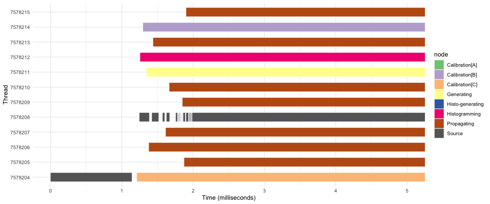
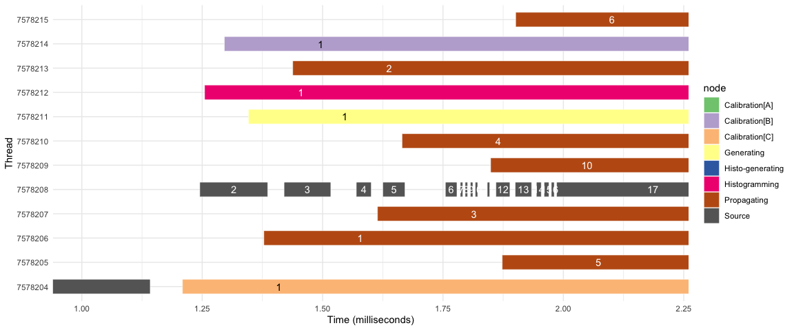
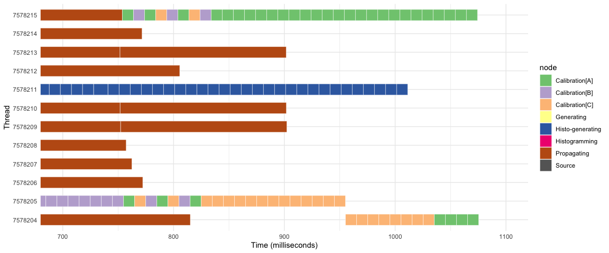
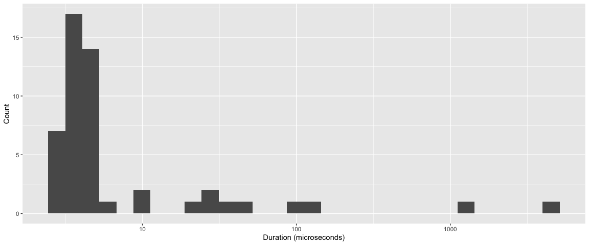
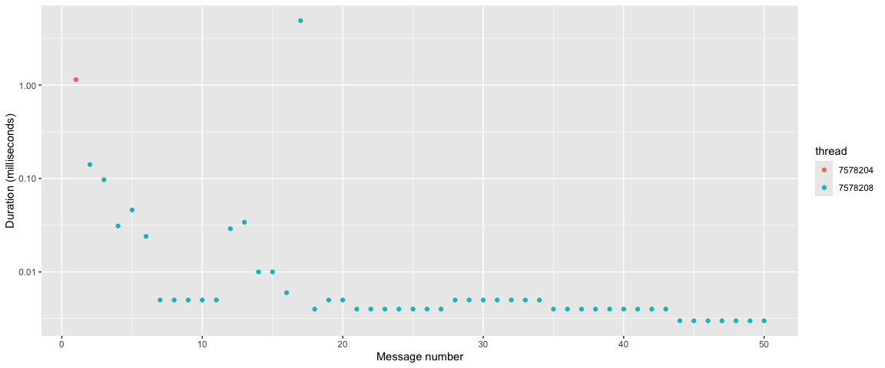
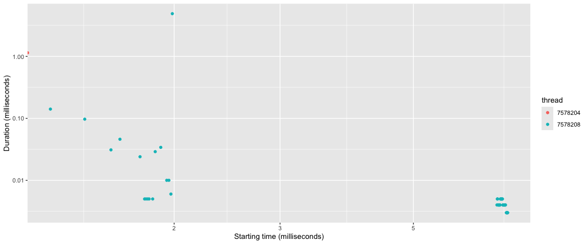

# Analysis of Serial Node Timing

## Introduction

This document provides some analysis of the timing performance of the
`serial_node` node type. It analysis a simple data flow with 7 nodes.

- One *Source* (input node) that generates a series of messages. Each
  message is represented by a single integer. As an input node, it is
  inherently serialized.
- One *Propagating* node. This node has unlimited parallelism.
- One *Histogramming* node. This node requires sole access to the *ROOT*
  token, of which there is only one.
- One *Generating* node. This node require sole access to the *GENIE*
  token, of which there is only one.
- One *Histo-Generating* node. This node requires simultaneous access to
  both the *ROOT* and *GENIE* tokens.
- Three *Calibration* nodes. These nodes are labeled *Calibration\[A\]*,
  *Calibration\[B\]*, and *Calibration\[C\]*. Each of these nodes
  requires sole access to a *DB* token. There are two *DB* tokens
  available. *DB* tokens have an associated integer ID; the values are 1
  and 13.

The *Source* node is directly connected to each of the other nodes.
There are no other connections between nodes. The tasks performed by the
system is the generation of the messages and the processing of each
message by all the other nodes in the system.

Each time a node is fired, we record two events. The *Start* event is
recorded as the first thing done within the body of the node. The node
then performs whatever work it is to do (for all but the *Source*, this
is a busy loop for some fixed time). The *Stop* event is recorded as the
last thing done within the body of the node. For each event, we record
the *thread* on which the event occurred, the *node* that was executing,
the *message* number, and the extra *data* associated with the event.
The extra data is meaningful only for the *Calibration* nodes; this data
is the *DB* token ID.

The event records are used to form the `events` data frame. Each task is
associated with both a *Start* and a *Stop* event. These times are
measured in milliseconds since the start of the first task. The `tasks`
data frame is formed by pivoting the `events` data frame to have a
single row for each task. The *duration* of each task is the difference
between the *Stop* and *Start* times, and is also recorded in
milliseconds.

The first few rows of the `tasks` data frame are shown in
<a href="#tbl-read-events" class="quarto-xref">Table 1</a> below.

Table 1: First few rows of the `tasks` data frame.

| thread  | node             | message | data | Start |    Stop | duration |
|:--------|:-----------------|--------:|-----:|------:|--------:|---------:|
| 5237323 | Source           |       1 |    0 | 0.000 |   0.611 |    0.611 |
| 5237323 | Calibration\[C\] |       1 |    1 | 0.629 |  10.640 |   10.011 |
| 5237326 | Histogramming    |       1 |    0 | 0.657 |  10.670 |   10.013 |
| 5237325 | Generating       |       1 |    0 | 0.665 |  10.677 |   10.012 |
| 5237328 | Source           |       2 |    0 | 0.676 |   0.726 |    0.050 |
| 5237321 | Propagating      |       1 |    0 | 0.689 | 150.790 |  150.101 |
| 5237318 | Calibration\[B\] |       1 |   13 | 0.713 |  10.775 |   10.062 |
| 5237328 | Source           |       3 |    0 | 0.794 |   0.815 |    0.021 |
| 5237324 | Propagating      |       2 |    0 | 0.796 | 150.851 |  150.055 |
| 5237328 | Source           |       4 |    0 | 0.825 |   0.867 |    0.042 |
| 5237327 | Propagating      |       3 |    0 | 0.857 | 150.900 |  150.043 |
| 5237328 | Source           |       5 |    0 | 0.876 |   0.978 |    0.102 |

The graph was executed with 50 messages, on a 12-core Mac laptop.

## Analysis of thread occupancy

Our main concern is to understand what the threads are doing, and to see
if the hardware is being used efficiently. By “efficiently”, we mean
that the threads are busy doing useful work — i.e., running our tasks.
<a href="#fig-thread-busy" class="quarto-xref">Fig. 1</a> shows the
timeline of task execution for each thread.

Figure 1: Task execution timeline, showing when each thread is busy and
what it is doing. This workflow was run on a 12-core Mac laptop.

The cores are all busy until about 750 milliseconds, at which time we
start getting some idle time. This is when there are no more
*Propagating* tasks to be started; this is the only node that has
unlimited parallelism. In this view, the *Source* tasks are completed so
quickly that we cannot see them.

<a href="#fig-program-start" class="quarto-xref">Fig. 2</a> zooms in on
the first 1.5 milliseconds of the program.

Figure 2: Task execution timeline, showing the startup of the program.

We can see that the *Source* is firing many times, and with a wide
spread of durations. We also see that the *Source* is serialized, as
expected for an input node. There appears to be some idle time after the
first firing of the *Source*. After the first firing, all the activity
for the *Source* moves to a different thread. There are some idle times
between source firings that we do not understand.

In <a href="#fig-program-start-after-first"
class="quarto-xref">Figure 3</a>, we can zoom in further to see what is
happening after the first firing of the *Source*. There are delays
between the creation of a message by the *Source* and the start of the
processing of that message by one of the other nodes, and that delay is
variable.

Figure 3: Task execution timeline, showing the time after the first
source firing. The numeric label in each rectangle shows the message
number being processed by the task.

We can also zoom in on the program wind-down, as shown in
<a href="#fig-program-wind-down" class="quarto-xref">Figure 4</a>. Here
it appears we have some inefficiency. On thread 5237312, there are two
gaps. During the first, it appears there is no work that could be done –
the outstanding tasks could not be run in parallel with the tasks that
are running. But this does not seem to be the case for the second gap.
We also see that at the very end of the program, only one thread is
running the *Calibration\[B\]* tasks. Since the calibration tasks are
independent of each other and we have two *DB* tokens, we should be able
to run two tasks. This is due to a design flaw in the `serial_node` node
type, which are unsure how to fix.

Figure 4: Task execution timeline, showing the time after the first
source firing.

## Looking on at calibrations

Flowgraph seem to prefer keeping some tasks on a single thread. All of
the *Histo-generating* tasks were run on a single thread. The
calibrations are clustered onto a few threads. This is shown in
<a href="#tbl-calibrations" class="quarto-xref">Table 2</a>.

Table 2: Number of calibrations of each type done by each thread.

| thread  | node             |   n |
|:--------|:-----------------|----:|
| 5237312 | Calibration\[A\] |   7 |
| 5237312 | Calibration\[B\] |  24 |
| 5237312 | Calibration\[C\] |   7 |
| 5237318 | Calibration\[B\] |   1 |
| 5237319 | Calibration\[A\] |   8 |
| 5237319 | Calibration\[B\] |   7 |
| 5237319 | Calibration\[C\] |  16 |
| 5237320 | Calibration\[A\] |   1 |
| 5237322 | Calibration\[A\] |  19 |
| 5237322 | Calibration\[B\] |   3 |
| 5237322 | Calibration\[C\] |   9 |
| 5237323 | Calibration\[A\] |  14 |
| 5237323 | Calibration\[B\] |  15 |
| 5237323 | Calibration\[C\] |  17 |
| 5237324 | Calibration\[A\] |   1 |
| 5237324 | Calibration\[C\] |   1 |

## Distribution of *Source* task durations

The body of the *Source* task consists of a single increment of an
integer. From this, one might assume that the duration of *Source* tasks
would be very similar to each other, and quite short. The data show
otherwise. Focusing on the distribution of durations for the *Source*
tasks, the variation is quite striking, as shown in
<a href="#fig-source-durations" class="quarto-xref">Figure 5</a>.

Figure 5: Distribution of durations for the Source tasks. Note the log
$x$ axis.

With such an extreme variation, we wonder if there may be some
interesting time structure. The *Source* generates numbers in sequence
and serially. Thus we can see time structure by plotting different
quantities as a function of either the sequential number (`message`)
(<a href="#fig-source-time-structure-by-message"
class="quarto-xref">Figure 6</a>) or as the starting time
(<a href="#fig-source-time-structure-by-start"
class="quarto-xref">Figure 7</a>).

Figure 6: Duration of Source tasks a function of the message number. The
color of the point indicates the thread on which the task was run.

Figure 7: Duration of Source tasks a function of the starting time. The
color of the point indicates the thread on which the task was run. Note
the log $x$ axis. Also note that the red point starts at time 0, but is
plotted at the edge of the graph because the log scale cannot extend to
time 0.

